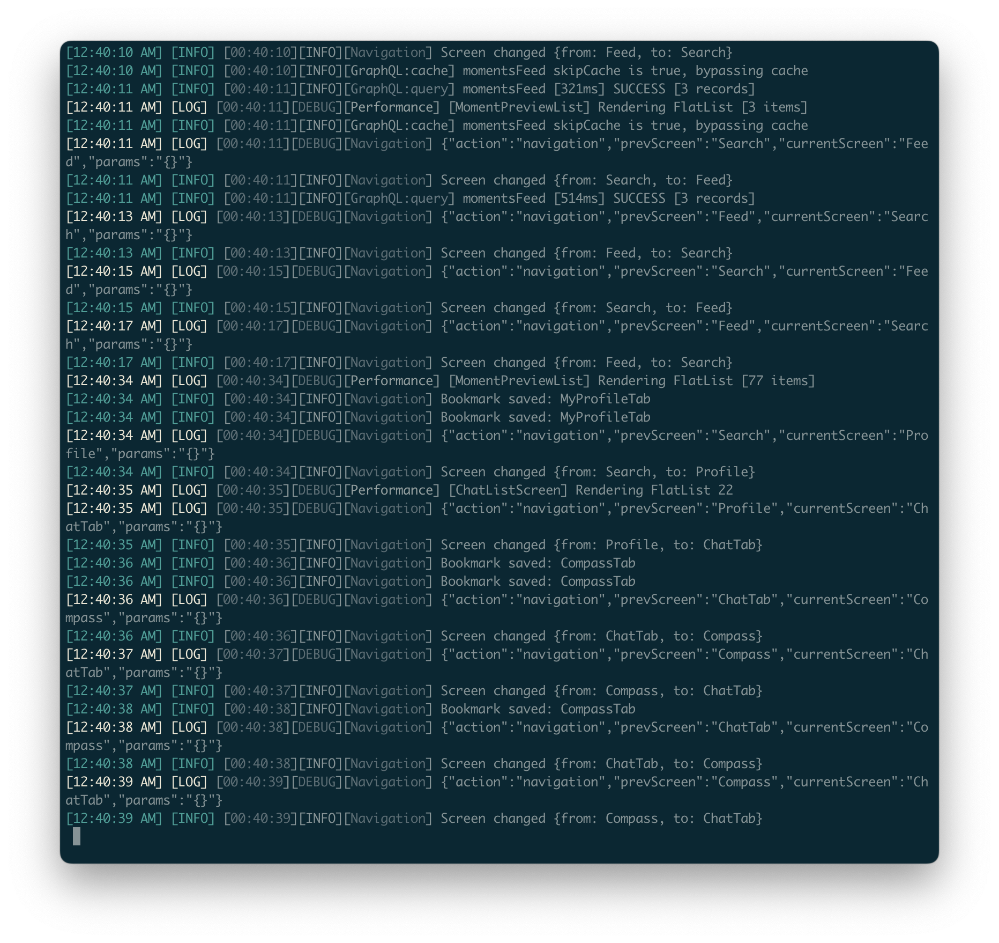

# React Native Logs

Simple CLI tool for viewing React Native Metro bundler logs in real-time. Start once and forget — automatically reconnects and saves logs to file.

[](https://badge.fury.io/js/react-native-logs)
[](https://opensource.org/licenses/MIT)



## Features

- 🚀 Start once, runs continuously with auto-reconnection
- 🎨 Color-coded log levels with clean output
- 💾 Saves logs to file automatically
- 🤖 Clean format perfect for AI debugging
- ⚙️ Configure via CLI args or environment variables

## Installation

```bash
# Install globally
npm install -g @noma4i/react-native-logs
# or
yarn global add @noma4i/react-native-logs

# Use without installing
npx @noma4i/react-native-logs
# or
yarn dlx @noma4i/react-native-logs
```

## Usage

```bash
rn-logs
```

## Options

```bash
# Custom Metro port
rn-logs --port 8082

# Timeout and reconnect settings
rn-logs --timeout 10000 --reconnect 2000

# Max log file lines
rn-logs --max-lines 500

# Help
rn-logs --help
```

## Environment Variables

| Variable | Description | Default |
|----------|-------------|---------|
| `RN_LOGS_PORT` | Metro bundler port | `8081` |
| `RN_LOGS_TIMEOUT` | Connection timeout (ms) | `5000` |
| `RN_LOGS_RECONNECT` | Reconnection delay (ms) | `3000` |
| `RN_LOGS_RETRY` | Retry delay (ms) | `5000` |
| `RN_LOGS_MAX_LINES` | Maximum lines in log file | `100` |

```bash
# Example usage
RN_LOGS_PORT=8082 RN_LOGS_TIMEOUT=10000 RN_LOGS_MAX_LINES=200 rn-logs
```

## Log Files

Logs are saved to `./logs/metro.log` with timestamps and clean formatting — perfect for AI debugging.

## License

MIT © [noma4i](https://github.com/noma4i)
